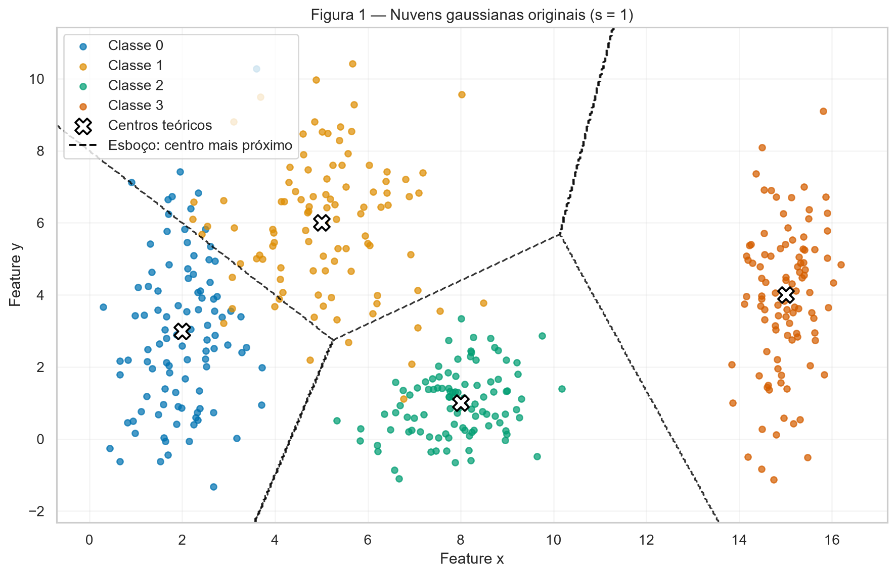
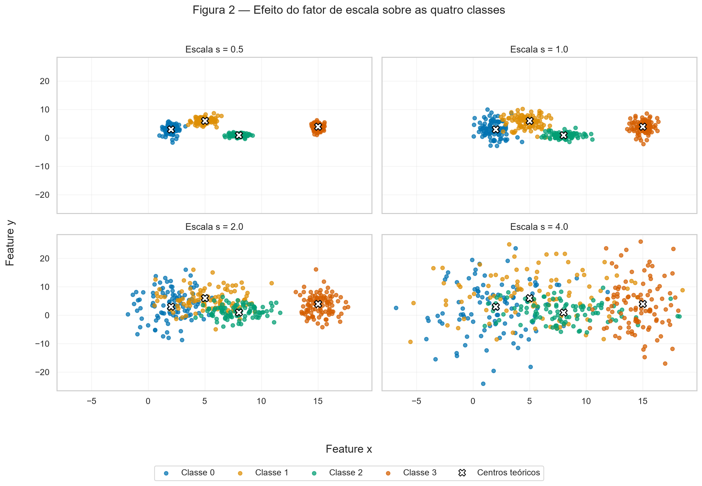
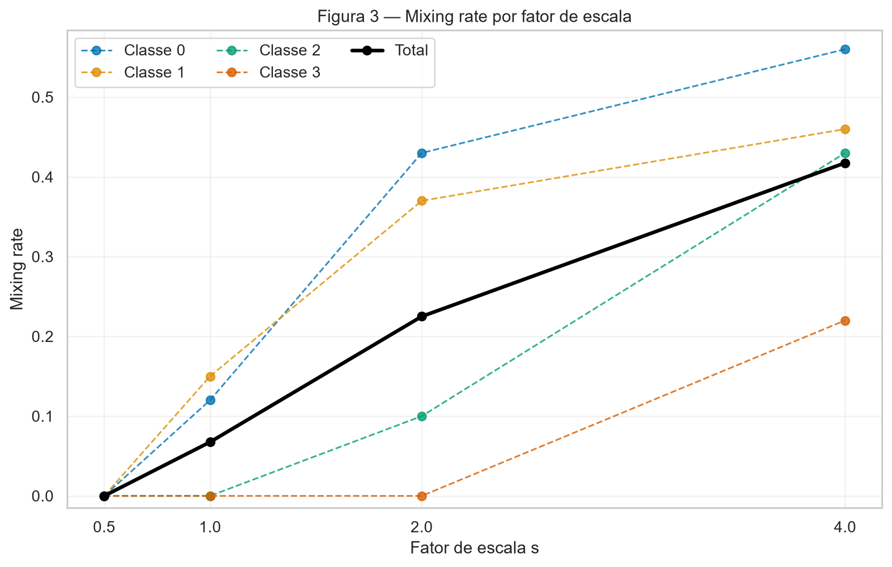
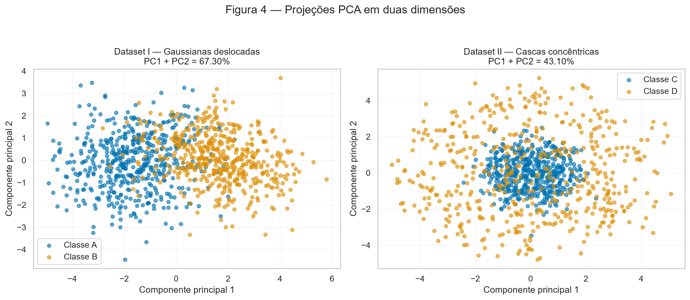
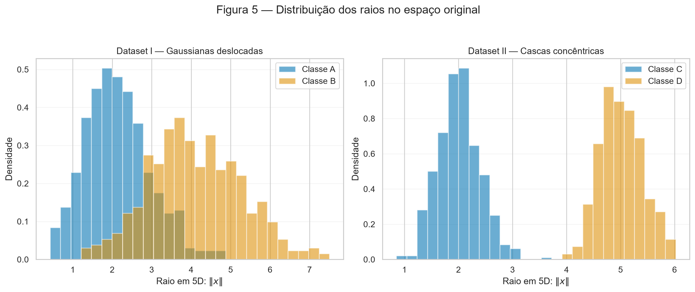
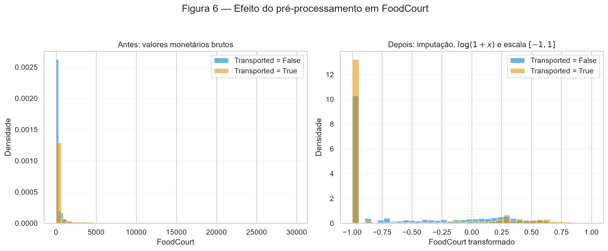

# 1. Data

Esta atividade investiga como a dispersão e a geometria dos dados afetam um problema de classificação e, em seguida, aplica os mesmos cuidados a um conjunto de dados real. Nenhum modelo foi treinado. Todos os dados sintéticos foram gerados com uma única instância `rng = np.random.default_rng(42)`, reutilizada em toda a execução. O split do terceiro exercício também foi produzido por essa mesma instância, de maneira estratificada.

O script gera as seis figuras e exporta as medidas intermediárias para `outputs/`. O arquivo `train.csv` do Spaceship Titanic é validado pelo cabeçalho, número de linhas e SHA-256 antes da análise.

!!! info "Reprodução e código"

    A partir da raiz do repositório, o trabalho pode ser reproduzido com:

    ```bash
    python docs/exercises/data/code/data_exercise.py
    ```

## Exercise 1

**Point Clouds: Geometry and Spread in 2D**

### A — Generate the clouds

Foram geradas 100 observações para cada uma das quatro classes, totalizando 400 pontos. Em cada classe, as duas features foram amostradas de gaussianas independentes com a média e o desvio-padrão especificados no enunciado.

| Classe | Média | Desvio-padrão |
|---:|---:|---:|
| 0 | $[2, 3]$ | $[0{,}8, 2{,}5]$ |
| 1 | $[5, 6]$ | $[1{,}2, 1{,}9]$ |
| 2 | $[8, 1]$ | $[0{,}9, 0{,}9]$ |
| 3 | $[15, 4]$ | $[0{,}5, 2{,}0]$ |

A Figura 1 marca as médias teóricas com `X`. As linhas tracejadas são o esboço pedido no item C: cada região corresponde ao centro mais próximo. Elas não são o resultado de um modelo treinado.



### B — More or less spread out

Foram gerados quatro datasets distintos, todos com as mesmas classes e médias. Somente os desvios-padrão foram multiplicados por $s \in \{0{,}5, 1, 2, 4\}$. A Figura 2 usa limites idênticos nos quatro subplots. Por isso as nuvens de $s=0{,}5$ parecem menores: a escala visual não foi ajustada separadamente para favorecer nenhum caso.



A razão de separação foi calculada com os parâmetros teóricos em $s=1$:

$$
r_{ij} = \frac{\lVert \mu_i-\mu_j \rVert}{\bar{\sigma}_i+\bar{\sigma}_j},
\qquad
\bar{\sigma}_k=\frac{\sigma_{k,x}+\sigma_{k,y}}{2}.
$$

| Par de classes | Distância entre médias | $r_{ij}$ em $s=1$ |
|:---:|---:|---:|
| (0, 1) | 4,243 | **1,326** |
| (0, 2) | 6,325 | 2,480 |
| (0, 3) | 13,038 | 4,496 |
| (1, 2) | 5,831 | 2,380 |
| (1, 3) | 10,198 | 3,642 |
| (2, 3) | 7,616 | 3,542 |

O menor valor é o do par **(0, 1)**: $r_{01}=1{,}3258$. Como as médias permanecem fixas e os desvios são multiplicados por $s$, a razão varia com $1/s$. Portanto, sem gerar novos pontos, em $s=2$ ela se torna $1{,}3258/2=\mathbf{0{,}6629}$.

Para medir a mistura, cada ponto foi comparado às quatro médias. O ponto foi contado como misturado quando o centro mais próximo não era o de sua classe original.

| Fator $s$ | Pontos misturados | Mixing rate |
|---:|---:|---:|
| 0,5 | 0 de 400 | 0,0000 (0,00%) |
| 1,0 | 27 de 400 | 0,0675 (6,75%) |
| 2,0 | 90 de 400 | 0,2250 (22,50%) |
| 4,0 | 167 de 400 | 0,4175 (41,75%) |



Na amostra gerada, **$s=1$ é o primeiro fator testado em que a separação por regiões delimitadas por retas deixa de ser perfeita**: as classes 0 e 1 já se interpenetram e o mixing rate sobe de 0 para 6,75%. Nesse ponto, a menor razão é justamente $r_{01}=1{,}326$. Em $s=2$, ela cai para 0,663 e a sobreposição fica muito mais evidente. Esta conclusão é empírica para os pontos amostrados; distribuições gaussianas possuem suporte ilimitado, então separação perfeita não é garantida teoricamente para qualquer $s$.

### C — Analysis

No dataset original, a sobreposição mais relevante ocorre entre as classes 0 e 1. Isso é consistente com elas formarem o par de menor $r_{ij}$ e concentrarem os 27 pontos misturados: 12 da classe 0 e 15 da classe 1. As classes 2 e 3 não apresentam mistura pelo critério do centro mais próximo em $s=1$.

Uma única reta divide o plano em apenas duas regiões e, portanto, não consegue atribuir quatro classes. Um conjunto de retas pode criar regiões diferentes para as quatro classes, como o esboço tracejado da Figura 1, mas não consegue eliminar os erros na área em que pontos das classes 0 e 1 se misturam. A fronteira mostrada é uma construção geométrica de centro mais próximo e representa uma possível aproximação linear por partes, não uma previsão aprendida.

Quando a dispersão aumenta, cresce a região ambígua atravessada pelas fronteiras. Nessa região, pontos de classes diferentes têm posições semelhantes e algum erro se torna inevitável para uma regra baseada somente nessas duas features. O crescimento do mixing rate de 0,00% para 41,75% quantifica essa expansão.

## Exercise 2

**Non-Linearity in Higher Dimensions**

### A — Dataset I: shifted Gaussians

O Dataset I contém 500 amostras da classe A e 500 da classe B em cinco dimensões. Usei `rng.multivariate_normal` com os vetores de médias e as matrizes de covariância fornecidos. As duas matrizes são válidas para amostragem: seus menores autovalores calculados foram positivos, 0,158 para $\Sigma_A$ e 0,498 para $\Sigma_B$.

A classe A está centrada na origem e possui correlação positiva de 0,8 entre as duas primeiras features. A classe B está centrada em $[1{,}5,1{,}5,1{,}5,1{,}5,1{,}5]$, tem variâncias maiores e correlação negativa de -0,7 entre as duas primeiras features. Assim, as classes diferem tanto pela posição quanto pelo formato da dispersão.

### B — Dataset II: concentric shells

Para cada observação, gerei primeiro $v \sim \mathcal{N}(0,I_5)$ e normalizei o vetor:

$$
u=\frac{v}{\lVert v\rVert}.
$$

Essa normalização produz direções uniformes na esfera unitária de $\mathbb{R}^5$. Em seguida, amostrei $\rho \sim \mathcal{N}(2,0{,}4)$ para a classe C e $\rho \sim \mathcal{N}(5,0{,}4)$ para a classe D, formando cada ponto por $x=\rho u$. O resultado são duas classes com o mesmo centro aproximado, mas raios diferentes.

### C — Visualize and compare

O PCA foi ajustado separadamente sobre cada dataset completo e usado somente para visualização. A soma das variâncias explicadas por PC1 e PC2 foi **67,30% no Dataset I** e **43,10% no Dataset II**.



A projeção preserva melhor a informação relevante para classificação no Dataset I. O deslocamento entre as médias aparece principalmente no primeiro componente e ainda produz uma tendência esquerda-direita. No Dataset II, três das cinco dimensões são descartadas; pontos da casca cuja direção está concentrada nessas dimensões podem ser projetados perto do núcleo, causando mistura no gráfico 2D.

As distâncias entre os centros amostrais, calculadas diretamente no espaço 5D, foram:

| Dataset | Distância entre os centros em 5D |
|---|---:|
| I — Gaussianas deslocadas | **3,3316** |
| II — Cascas concêntricas | **0,2347** |

Apesar da pequena distância entre centros no Dataset II, os histogramas dos raios não se sobrepõem na amostra. A Figura 5 mostra que centro e raio descrevem aspectos diferentes da geometria dos dados.



### D — Analysis

Uma fronteira linear tem a forma $w^Tx+b=0$ e divide o espaço em dois semiespaços. Ela não consegue deixar um núcleo em um lado e, simultaneamente, toda uma casca que o envolve no outro: qualquer hiperplano que atravesse o espaço corta a casca. Coletar mais dados não altera essa topologia; apenas torna a estrutura concêntrica mais evidente.

A mistura observada em uma projeção PCA 2D também não prova inseparabilidade no espaço original. PCA é uma transformação linear orientada à variância global, não uma transformação supervisionada orientada às classes. Neste caso, a projeção retém 43,10% da variância do Dataset II e perde parte da informação radial distribuída pelas outras três dimensões.

Uma função simples que separa a amostra é o raio ao quadrado:

$$
q(x)=\lVert x\rVert^2=\sum_{i=1}^{5}x_i^2,
\qquad
\widehat{y}=\mathbb{1}[q(x)>14{,}5139].
$$

O maior $q(x)$ observado no núcleo foi 13,3992 e o menor na casca foi 15,6286; o limiar foi escolhido no meio desse intervalo. A regra produziu **0 erros nas 1.000 observações**. Sua fronteira é uma hiperesfera, portanto é não linear nas features originais.

## Exercise 3

**Preparing Real-World Data for a Neural Network**

### A — Get to know the data

O [Spaceship Titanic](https://www.kaggle.com/competitions/spaceship-titanic/data) contém registros recuperados de passageiros de uma nave. O objetivo é prever `Transported`: `True` indica que o passageiro foi transportado para outra dimensão durante a colisão com uma anomalia espaço-temporal; `False` indica que não foi.

O `train.csv` possui **8.693 linhas e 14 colunas**, incluindo o alvo. Há 4.378 exemplos positivos e 4.315 negativos, correspondendo a **50,36% `True`** e **49,64% `False`**. Portanto, as classes estão praticamente balanceadas.

| Tipo | Features |
|---|---|
| Numéricas | `Age`, `RoomService`, `FoodCourt`, `ShoppingMall`, `Spa`, `VRDeck` |
| Categóricas | `HomePlanet`, `CryoSleep`, `Cabin`, `Destination`, `VIP` |
| Identificador/texto | `PassengerId`, `Name` |
| Alvo booleano | `Transported` |

Valores ausentes no arquivo completo:

| Coluna | Ausentes | Percentual |
|---|---:|---:|
| `PassengerId` | 0 | 0,00% |
| `HomePlanet` | 201 | 2,31% |
| `CryoSleep` | 217 | 2,50% |
| `Cabin` | 199 | 2,29% |
| `Destination` | 182 | 2,09% |
| `Age` | 179 | 2,06% |
| `VIP` | 203 | 2,34% |
| `RoomService` | 181 | 2,08% |
| `FoodCourt` | 183 | 2,11% |
| `ShoppingMall` | 208 | 2,39% |
| `Spa` | 183 | 2,11% |
| `VRDeck` | 188 | 2,16% |
| `Name` | 200 | 2,30% |
| `Transported` | 0 | 0,00% |

Estatísticas das cinco colunas de gastos antes do split e das transformações:

| Coluna | Média | Mediana | Máximo |
|---|---:|---:|---:|
| `RoomService` | 224,69 | 0,00 | 14.327 |
| `FoodCourt` | 458,08 | 0,00 | 29.813 |
| `ShoppingMall` | 173,73 | 0,00 | 23.492 |
| `Spa` | 311,14 | 0,00 | 22.408 |
| `VRDeck` | 304,85 | 0,00 | 24.133 |

Todas as medianas são zero, enquanto as médias são positivas e os máximos chegam a dezenas de milhares. Isso indica uma grande concentração de passageiros sem gastos e uma cauda longa à direita formada por poucos valores muito altos. A média é puxada por esses extremos e deixa de representar um passageiro típico.

### B — Split before you transform

O split estratificado separou **6.954 linhas para treino (80%)** e **1.739 para teste (20%)**. A classe positiva corresponde a 50,36% do treino e 50,37% do teste. A estratificação foi implementada com a mesma instância `rng` usada nos exercícios anteriores, preservando reprodutibilidade e as proporções do alvo.

O split precisa ocorrer antes da imputação, codificação e escala porque medianas, modas, categorias e limites são parâmetros aprendidos a partir dos dados. Calculá-los no dataset inteiro permitiria que informações do teste influenciassem a representação do treino, caracterizando data leakage e tornando a avaliação futura otimista. Por isso, cada transformação foi ajustada no treino e somente aplicada ao teste.

### C — Preprocess

**Dados ausentes.** As features numéricas foram imputadas pela mediana do treino, uma escolha robusta às caudas longas. As medianas aprendidas foram 27 para `Age` e 0 para cada coluna de gastos. As features categóricas foram imputadas pela moda do treino: `Earth`, `False`, `TRAPPIST-1e` e `False`, respectivamente. Nenhuma estatística do teste foi usada.

**Features categóricas.** `HomePlanet`, `CryoSleep`, `Destination` e `VIP` foram convertidas por one-hot encoding. O encoder usa `handle_unknown="ignore"`; se surgir no teste uma categoria ausente no treino, todas as colunas conhecidas daquele atributo recebem zero, sem erro e sem criar uma nova coluna a partir do teste.

**Feature engineering.** Depois da imputação numérica, `TotalSpend` foi calculada como a soma de `RoomService`, `FoodCourt`, `ShoppingMall`, `Spa` e `VRDeck`. `Cabin`, `Name` e `PassengerId` foram removidas conforme solicitado. A matriz final contém sete features numéricas — `Age`, cinco gastos e `TotalSpend` — e dez colunas one-hot.

**Caudas longas.** A transformação $\log(1+x)$ foi aplicada aos cinco gastos e também a `TotalSpend`, pois a soma preserva a mesma assimetria. O uso de $1+x$ mantém os zeros definidos. A transformação comprime diferenças entre valores muito altos sem apagar a ordenação dos gastos, reduzindo a chance de poucas observações dominarem os gradientes ou levarem ativações `tanh` rapidamente à saturação.

**Escala.** As sete features numéricas foram transformadas por `MinMaxScaler(feature_range=(-1, 1), clip=True)`. Os mínimos e máximos foram aprendidos somente no treino. `clip=True` limita no teste valores que ultrapassem esses extremos, mantendo a entrada no intervalo planejado. As colunas one-hot permanecem em $\{0,1\}$, também compatível com a faixa de `tanh`.

### D — Verify and visualize

A Figura 6 apresenta `FoodCourt` no conjunto de treino. Antes do tratamento, a massa em zero comprime visualmente quase toda a distribuição, enquanto poucos gastos alcançam 29.813. Depois de imputação, $\log(1+x)$ e escala, a cauda passa a ocupar uma faixa muito menor e os valores ficam entre -1 e 1. O pico em -1 permanece porque zero é um valor real e frequente, não apenas um dado ausente.



Verificações finais:

- `NaN` restantes no treino ou teste: **0**;
- shape da matriz de treino: **(6.954, 17)**;
- shape da matriz de teste: **(1.739, 17)**;
- intervalo global do treino: **[-1, 1]**;
- intervalo global do teste: **[-1, 1]**.

A decisão com maior impacto esperado sobre o treinamento é a combinação de $\log(1+x)$ com a escala $[-1,1]$. Os gastos brutos têm mediana zero e máximos acima de 20 mil; sem compressão, essas features dominariam as demais e empurrariam muitas ativações `tanh` para regiões saturadas, onde o gradiente é pequeno. A transformação logarítmica reduz a assimetria, e a escala coloca idade, gastos e `TotalSpend` em magnitudes comparáveis. O split antes de todo esse processo é igualmente indispensável para que o efeito medido futuramente não seja contaminado por leakage.

??? abstract "Código completo executado"

    ```python
    --8<-- "docs/exercises/data/code/data_exercise.py"
    ```

## Results summary

| # | Item | Your value |
|---:|---|---:|
| 1 | Mixing rate at $s = 0.5$ | 0,0000 (0,00%) |
| 2 | Mixing rate at $s = 1.0$ | 0,0675 (6,75%) |
| 3 | Mixing rate at $s = 2.0$ | 0,2250 (22,50%) |
| 4 | Mixing rate at $s = 4.0$ | 0,4175 (41,75%) |
| 5 | Smallest $r_{ij}$ at $s = 1.0$, and which pair | 1,3258 — par (0, 1) |
| 6 | Distance between centers — Dataset I | 3,3316 |
| 7 | Distance between centers — Dataset II | 0,2347 |
| 8 | Explained variance PC1 + PC2 — Dataset I | 0,6730 (67,30%) |
| 9 | Explained variance PC1 + PC2 — Dataset II | 0,4310 (43,10%) |
| 10 | Share of the positive class in `Transported` | 0,5036 (50,36%) |
| 11 | Mean and median of `FoodCourt` on the training set, before transforming | média 445,994; mediana 0,000 |
| 12 | Final `shape` of the training feature matrix | (6.954, 17) |
| 13 | Minimum and maximum of the training and test sets after scaling | treino [-1, 1]; teste [-1, 1] |
