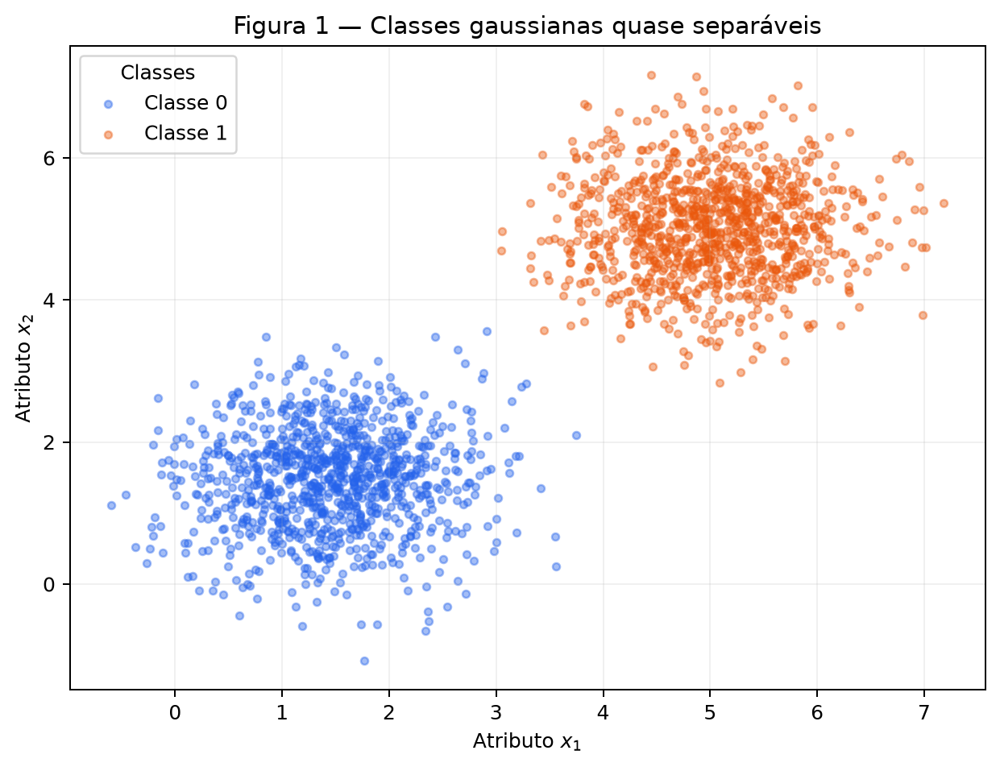
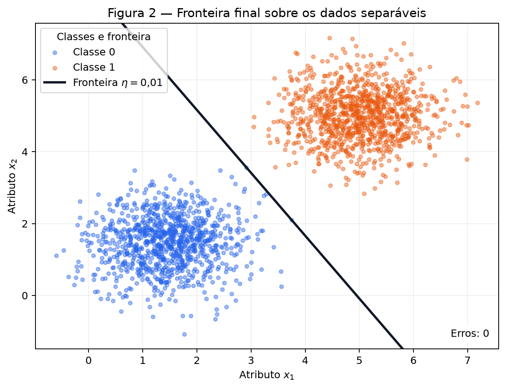
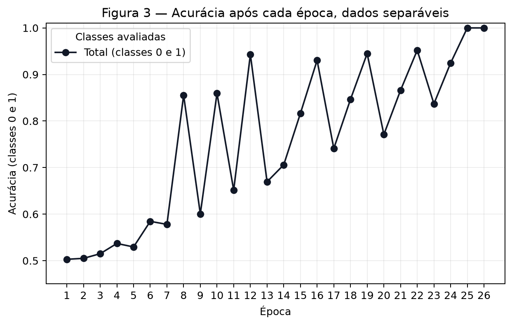
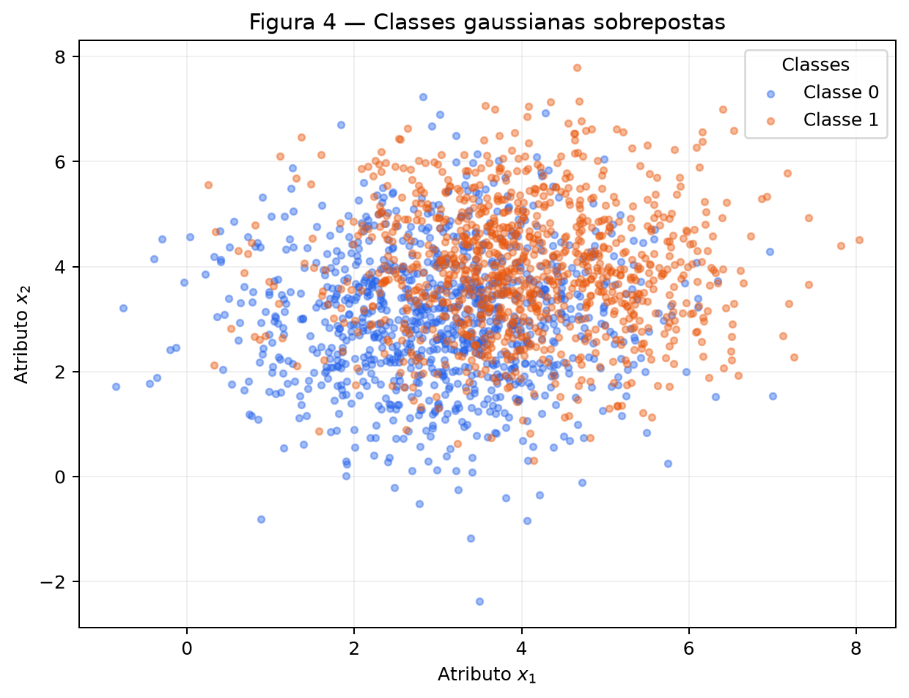
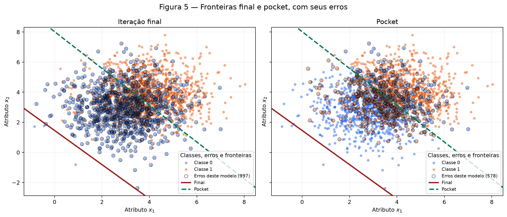
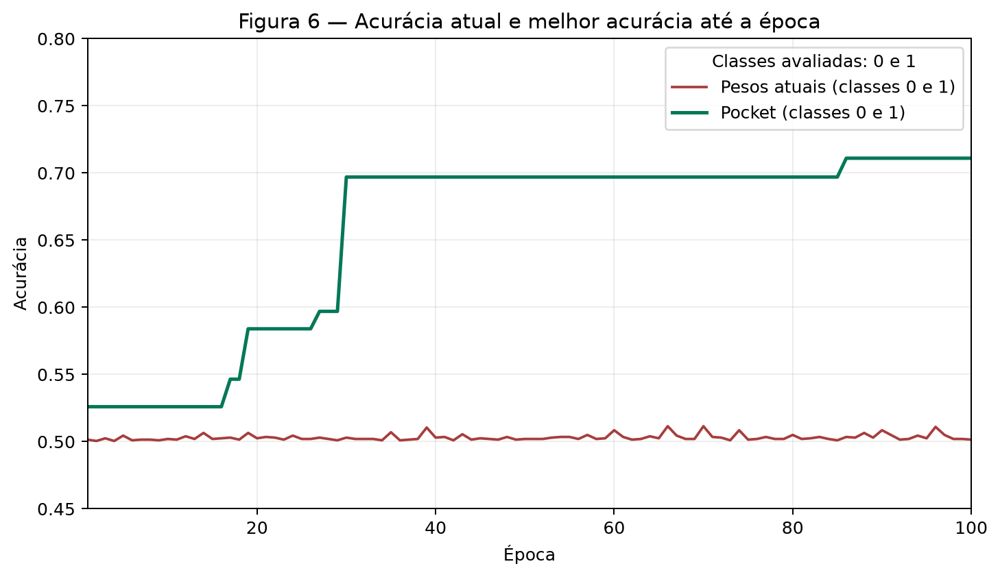

# 2. Perceptron

Esta atividade compara o mesmo perceptron em duas geometrias: um conjunto de pontos que admite uma separação linear e outro com classes sobrepostas. O modelo, a função degrau, a regra de atualização e o laço de treinamento foram implementados diretamente com NumPy. Matplotlib foi usado somente para as figuras. Os parâmetros seguem o [enunciado da Atividade 2](https://insper.github.io/ann-dl/2026.2/exercises/perceptron/).

Todo o experimento é reproduzível com **uma única instância** `rng = np.random.default_rng(42)`, criada no início do script e passada às operações aleatórias. Cada conjunto é gerado na ordem classe 0, depois classe 1, e as épocas percorrem essa ordem, sem embaralhamento. Essa escolha é relevante para o estado final do Exercício 2 e está explícita para que os números possam ser reproduzidos.

Execute a partir da raiz do repositório, após instalar `requirements.txt`:

```bash
python docs/exercises/perceptron/code/perceptron_exercise.py
```

O script salva as Figuras 1 a 6 em `figures/` e as medidas, inclusive as curvas por época, em [`outputs/results.json`](outputs/results.json). A dificuldade principal foi registrar a melhor acurácia **a cada atualização**, sem confundi-la com a acurácia apenas ao fim de uma época. Para isso, o pocket conserva cópias dos parâmetros quando encontra uma melhora estrita; o treinamento continua com os parâmetros atuais.

## Exercise 1

### A — Generate the data

Foram geradas 1.000 amostras por classe, cada uma com duas coordenadas, usando `rng.multivariate_normal`:

| Classe | Média | Covariância |
|---|---|---|
| 0 | $[1{,}5,\,1{,}5]$ | $\begin{bmatrix}0{,}5&0\\0&0{,}5\end{bmatrix}$ |
| 1 | $[5,\,5]$ | $\begin{bmatrix}0{,}5&0\\0&0{,}5\end{bmatrix}$ |

Na Figura 1, as nuvens ficam distantes em relação à sua dispersão. Para esta amostra de 2.000 pontos, o perceptron encontra uma reta com zero erros.



### B — Implement the perceptron

A predição é $\hat y = \operatorname{step}(\mathbf{w}\cdot\mathbf{x}+b)$, com $\operatorname{step}(z)=1$ quando $z\geq 0$ e $0$ caso contrário. Para cada amostra, calculamos $e=y-\hat y$ e atualizamos:

$$
\mathbf{w}\leftarrow\mathbf{w}+\eta e\mathbf{x},
\qquad
b\leftarrow b+\eta e.
$$

Com rótulos $\{0,1\}$, $e=0$ em um acerto, $+1$ quando um exemplo da classe 1 é previsto como 0 e $-1$ quando um exemplo da classe 0 é previsto como 1. Assim, um acerto não muda os parâmetros. A forma $\mathbf{w}\leftarrow\mathbf{w}+\eta y\mathbf{x}$, encontrada para rótulos $\{-1,+1\}$, seria inadequada aqui: se $y=0$, nunca corrigiria um falso positivo da classe 0.

O vetor inicial foi sorteado como `rng.normal(0, 0.01, size=2)`, resultando em $\mathbf{w}_0=[0{,}002532,\,0{,}008952]$, e $b_0=0$. A taxa principal é $\eta=0{,}01$. Uma época é uma passagem completa pelas 2.000 amostras. O laço encerra quando uma época produz **zero atualizações** ou quando alcança **100 épocas**, registrando a acurácia do conjunto inteiro após cada passagem.

??? abstract "Código completo: geração, perceptron, pocket e figuras"

    ```python
    --8<-- "docs/exercises/perceptron/code/perceptron_exercise.py"
    ```

### C — Train and measure

Com $\eta=0{,}01$, os parâmetros finais foram $\mathbf{w}=[0{,}050497,\,0{,}028872]$ e $b=-0{,}250000$. A acurácia final foi **100,00% (2.000/2.000)** em **26 épocas**; a época 26 confirmou a parada com zero atualizações. A Figura 2 mostra a reta $\mathbf{w}\cdot\mathbf{x}+b=0$. Não há pontos mal classificados a destacar nesta figura, e a anotação registra **0 erros**.



A Figura 3 mostra a acurácia medida após cada época. Ela chega a 100% na época 25, e a passagem seguinte confirma que nenhum ponto exige correção. Os saltos anteriores decorrem da avaliação no fim de cada passagem em uma ordem fixa: a última atualização em uma classe pode piorar temporariamente a outra.



### D — Analysis

**Convergência.** Havendo uma reta que separa todas as amostras com margem positiva, cada erro desloca os parâmetros na direção indicada por $e\mathbf{x}$ e $e$. Em dados finitos separáveis, o teorema de convergência do perceptron garante um número finito de atualizações. Nesta execução as épocas iniciais tiveram de 3 a 4 correções; houve oscilações, mas as últimas tiveram 1 e depois **0**. A curva de acurácia não precisa subir monotonamente para que o algoritmo convirja.

**Mudança somente de $\eta$.** Repeti o treinamento com $\eta=1{,}0$, usando exatamente o mesmo $\mathbf{w}_0$, $b_0$, conjunto e ordem. Esta execução alcançou **100,00% em 37 épocas**, com $\mathbf{w}=[5{,}870616,\,3{,}359239]$ e $b=-31{,}000000$. As direções normalizadas foram:

| Taxa | $\mathbf{w}/\lVert\mathbf{w}\rVert$ | $b/\lVert\mathbf{w}\rVert$ | Épocas | Acurácia |
|---:|---|---:|---:|---:|
| $0{,}01$ | $[0{,}868123,\,0{,}496349]$ | $-4{,}297888$ | 26 | 100,00% |
| $1{,}0$ | $[0{,}867950,\,0{,}496652]$ | $-4{,}583241$ | 37 | 100,00% |

As direções ficaram **quase iguais**, mas não idênticas; o produto interno entre elas é $0{,}99999994$. As retas também têm deslocamentos diferentes, como mostra $b/\lVert\mathbf{w}\rVert$. Com início não nulo de magnitude próxima a $0{,}01$, mudar $\eta$ altera o tamanho de cada correção **em relação ao vetor inicial**, o caminho de erros e a fronteira encontrada. Isso explica por que as duas execuções acertam todos os pontos, mas param após números diferentes de épocas.

**Se o início fosse zero.** Considere o parâmetro ampliado $\theta=(\mathbf{w},b)$, a entrada ampliada $\tilde{\mathbf{x}}=(\mathbf{x},1)$ e $\theta_0=\mathbf{0}$. Após qualquer sequência de $t$ exemplos visitados,

$$
\theta_t(\eta)
=\eta\sum_{k<t} e_k\tilde{\mathbf{x}}_k.
$$

Para duas taxas positivas $\eta_1$ e $\eta_2$, a indução começa em $\theta_0(\eta_2)=(\eta_2/\eta_1)\theta_0(\eta_1)=0$. Se a relação vale antes do próximo exemplo, os escores têm o mesmo sinal porque $\eta_2/\eta_1>0$; portanto, as duas execuções fazem a mesma predição, obtêm o mesmo erro $e_k$ e preservam a relação após a atualização. Logo, $\theta_t(\eta_2)=(\eta_2/\eta_1)\theta_t(\eta_1)$ em cada passo. Multiplicar pesos **e bias** por uma constante positiva preserva a fronteira e os erros: as épocas seriam idênticas. O início não nulo evita essa invariância.

## Exercise 2

### A — Generate the data

Com a **mesma instância de `rng`**, foram geradas mais 1.000 amostras por classe, agora com médias próximas e covariância três vezes maior:

| Classe | Média | Covariância |
|---|---|---|
| 0 | $[3,\,3]$ | $\begin{bmatrix}1{,}5&0\\0&1{,}5\end{bmatrix}$ |
| 1 | $[4,\,4]$ | $\begin{bmatrix}1{,}5&0\\0&1{,}5\end{bmatrix}$ |

A Figura 4 mostra a forte sobreposição no espaço original. Também há um certificado geométrico de que **nenhuma reta separa perfeitamente esta amostra**: o primeiro ponto gerado da classe 1, $[5{,}058233,\,4{,}743093]$, está estritamente dentro de um triângulo formado pelos pontos de índices 625, 842 e 799 da classe 0. Seus coeficientes de combinação convexa são $[0{,}567664,\,0{,}130235,\,0{,}302101]$, todos positivos e somando 1. Qualquer função afim negativa nos três vértices da classe 0 também seria negativa nesse ponto da classe 1; por isso, a classificação linear perfeita é impossível.



### B — Train, keeping the best weights

Foi chamada a **mesma função `train_perceptron`** do Exercício 1, com $\eta=0{,}01$ e limite de 100 épocas. O novo vetor inicial, sorteado da mesma instância de `rng`, foi $[0{,}012158,\,-0{,}004510]$; o bias inicial permaneceu zero. Depois de cada erro e da respectiva atualização, o código mede a acurácia nos 2.000 pontos. Quando ela supera estritamente a melhor observada, copia pesos e bias para o pocket. A acurácia inicial também é considerada. Empates mantêm o primeiro melhor estado; o pocket não interfere nas atualizações seguintes.

| Estado | Pesos $\mathbf{w}$ | Bias $b$ | Acurácia |
|---|---|---:|---:|
| Iteração final, época 100 | $[0{,}054484,\,0{,}048043]$ | $-0{,}070000$ | **50,15%** (1.003/2.000) |
| Pocket, obtido na época 86 | $[0{,}010664,\,0{,}008727]$ | $-0{,}070000$ | **71,10%** (1.422/2.000) |

O pocket foi registrado na **atualização 247**, durante a **época 86**. Nenhuma das 100 épocas ficou sem erros; a parada ocorreu pelo limite, como previsto. A diferença de **20,95 pontos percentuais** entre o pocket e a última iteração é parte do resultado observado, não um ajuste posterior.

### C — Figures

A Figura 5 usa dois painéis com os mesmos limites. Em ambos, a linha vermelha é a fronteira da última iteração e a linha verde tracejada é a do pocket. Os círculos pretos indicam os **erros do modelo nomeado no painel**: 997 à esquerda e 578 à direita. A reta final passa longe da maior parte das duas nuvens; a do pocket cruza a região em que as classes se misturam.



A Figura 6 compara a acurácia dos pesos correntes ao fim de cada época com a melhor acurácia já registrada após qualquer atualização. A primeira oscila perto de 50%; a segunda só sobe quando o pocket melhora e atinge **71,10% na época 86**.



### D — Analysis

**Por que o último estado é ruim?** A fronteira final intercepta a diagonal $x_1=x_2$ em aproximadamente $(0{,}683,\,0{,}683)$, distante do centro das nuvens, perto de $(3{,}5,\,3{,}5)$. Ela prevê classe 1 para **1.997 dos 2.000 pontos**. Como as classes têm 1.000 pontos cada, isso produz quase 50% de acurácia. A fronteira pocket intercepta a mesma diagonal em aproximadamente $(3{,}610,\,3{,}610)$ e é bem mais útil. Para comparação, a reta fixa $x_1+x_2=7$ acerta **71,25%** desta amostra; os **71,10%** do pocket ficam a apenas **0,15 ponto percentual** desse referencial e perto dos aproximadamente 73% citados no enunciado.

A cada erro, $|\Delta b|=\eta=0{,}01$, enquanto $\lVert\Delta\mathbf{w}\rVert=\eta\lVert\mathbf{x}\rVert$. A norma média dos pontos gerados é **5,111**, portanto uma correção típica de pesos tem norma próxima de **0,051**, cerca de cinco vezes a correção no bias. A ordem fixa visita a classe 0 antes da classe 1 em todas as épocas. Sem uma reta que satisfaça ambas, erros continuam ocorrendo e as últimas correções deslocam o estado corrente; após a classe 1, a reta terminou abaixo das nuvens. Não existe, na regra de atualização original, mecanismo para conservar a melhor fronteira anterior. O pocket acrescenta exatamente essa memória.

**Comparação das curvas e teorema.** A Figura 3 termina com duas medições consecutivas de 100%, e a última época não tem atualizações. Na Figura 6, houve de **2 a 5 atualizações em cada uma das 100 épocas**; a acurácia corrente não estabilizou em um separador perfeito. O teorema de convergência garante parada em um número finito de correções **se existe uma fronteira linear com margem positiva para todos os exemplos**, em uma sequência de apresentação que continue visitando os erros. Essa hipótese de separabilidade é violada pelas classes sobrepostas do Exercício 2. O teorema, portanto, não promete convergência neste caso.

**Mais épocas ou outra taxa?** Mais épocas podem dar ao pocket outras oportunidades de melhorar, mas não criam uma reta que classifique perfeitamente exemplos sobrepostos e não impedem o estado final de terminar longe da melhor solução. Diminuir $\eta$ encolhe $\Delta b$ e $\Delta\mathbf{w}$ na mesma proporção; o quociente $\lVert\Delta\mathbf{w}\rVert/|\Delta b|=\lVert\mathbf{x}\rVert$ continua perto de 5 para uma correção típica. Com o início não nulo fixo, a trajetória numérica pode mudar, mas a ausência de separabilidade e a limitação de uma fronteira linear permanecem.

## Results summary

| # | Quantity | Value |
|---:|---|---|
| 1 | Exercise 1 — final $\mathbf{w}$ and $b$ | $[0{,}050497,\,0{,}028872]$; $b=-0{,}250000$ |
| 2 | Exercise 1 — epochs to convergence | 26 |
| 3 | Exercise 1 — final accuracy | 100,00% (2.000/2.000) |
| 4 | Exercise 1 — epochs and final accuracy with $\eta=1{,}0$ | 37 épocas; 100,00% (2.000/2.000) |
| 5 | Exercise 2 — final $\mathbf{w}$ and $b$ | $[0{,}054484,\,0{,}048043]$; $b=-0{,}070000$ |
| 6 | Exercise 2 — accuracy of the final weights | 50,15% (1.003/2.000) |
| 7 | Exercise 2 — accuracy of the pocket weights | 71,10% (1.422/2.000) |
| 8 | Exercise 2 — epoch at which the pocket best occurred | época 86 (atualização 247) |
